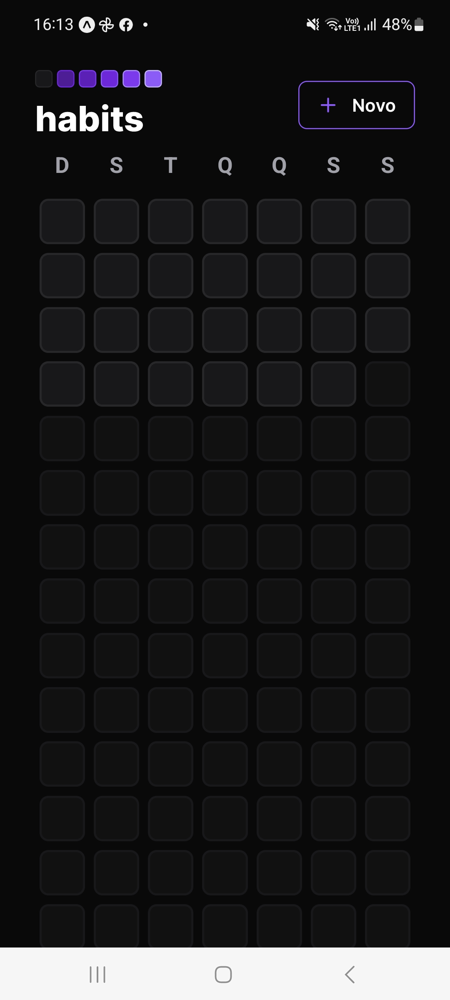
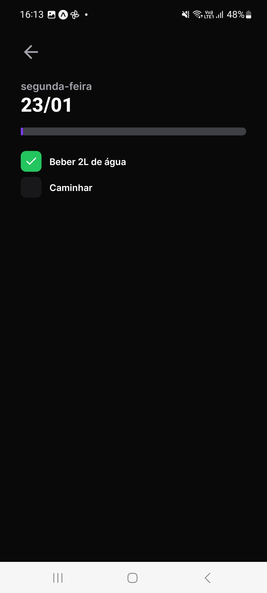
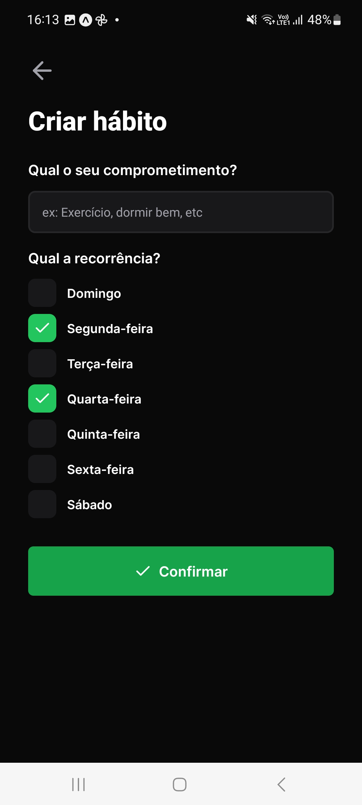

# Setup-NLW

## 🚀 Projeto
Um controlador de hábitos com visualização do progresso dia-a-dia!</br>
Aplicação desenvolvida durante a Next Level Week, realizada pela [@Rocketseat](https://www.rocketseat.com.br) em jan/23.

<div align="center">
  
  
  
</div>


## 🛠️ Tecnologias
- 📊 Backend: [Node.js](https://nodejs.org/en/) | [Prisma](https://www.prisma.io)
- 🖼️ Frontend: [React](https://pt-br.reactjs.org) | [Tailwind CSS](https://tailwindcss.com)
- 📱 Mobile: [React Native](https://reactnative.dev) | [Expo](https://expo.dev)


## 🗂️ Utilização

### 🐑🐑 Clonando o repositório:

```bash
  $ git clone url-do-projeto.git
```

### ▶️ Rodando o App:

📊 Backend
```bash
  $ cd back                 #change to this directory
  $ npm install             #download dependencies to node_modules
  $ npx prisma migrate dev  #creates the local dev.db file
  $ npx prisma db seed      #populates the db with data from the seed.ts file
  $ npx prisma studio       #db management thru a control panel in a web browser tab
  $ npm run dev             #start the project
```

🖼️ Frontend
```bash
  $ cd front                #change to this directory
  $ npm install             #download dependencies to node_modules
  $ npm run dev             #start the project
```

📱 Mobile
```bash
  $ cd mobile               #change to this directory
  $ npm install             #download dependencies to node_modules
  $ npx expo start          #start the project
  #The terminal will compile the code and display a QR code. Open the Expo Go app, and scan this QR code to see the project running on your phone
```
